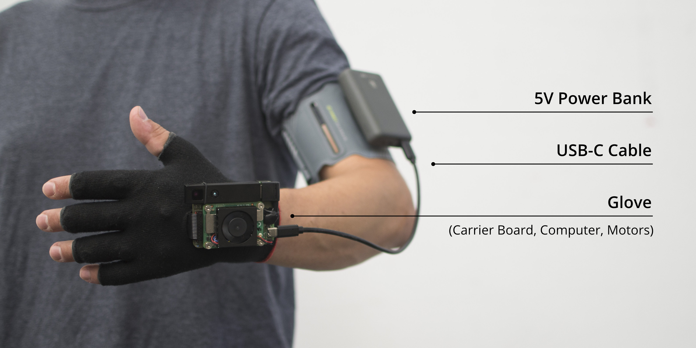
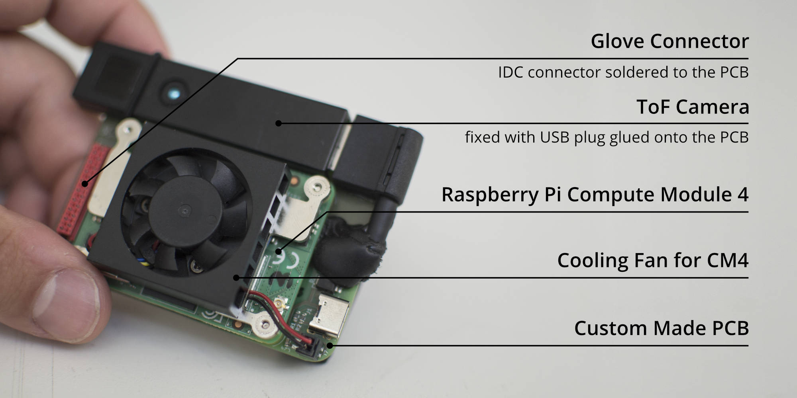

# Unfolding Space Hardware

This repo contains the **hardware documentation of the “Unfolding Space” glove** – a prototypical open source navigation aid system for the visually impaired. 

Please check out the main repository of the [Unfolding Space](https://www.github.com/jakobkilian/unfolding-space) project for more information and a list of related repos anc content.

## Overall structure

In order to be able to use the Unfolding Space Glove, a relatively large amount of custom work is necessary. The following readme is only intended to give an overview of this and the contents of this repo. Note that not all details or design decisions are not documented here - if you really plan to build your own model, feel free to contact me if you have any questions.

The overall structure consists of 3 components:

- **5V USB power bank:** You can basically use any and wear it wherever you want. To keep the cable out of the way, I attached it to the upper arm with a sports arm band. I was using:
  - [Hama Power Pack *Supreme 10HD*](https://hama.com/00188307/hama-power-pack-supreme-10hd-10000mah). Raspis are picky about the supply voltage – if it drops too low (I think below 4.8 V), they reboot. Since they consume up to 3 A, the voltage of many batteries can easily drop below 5.0 V at peaks. Use high-quality power packs and 10 Ah to avoid this in advance or find one having stable output with > 4.9 V.
  - [SP Connect Running Band](https://sp-connect.com/collections/mounts/products/running-band) and a adhesive [Universal Interface](https://sp-connect.com/collections/phone-cases/products/universal-interface) was used to mount the power bank to the upper arm. Expensive but very reliable for this use case. There is tons of other, cheaper options out there.
- **USB-C Cable:** Here too, maintaining the voltage is crucial: use the shortest possible cable with good quality. The thickness of the insulation is a good indicator for low voltage drop, but only cutting and testing the copper wires can provide certainty. I had a 30 cm USB-A to USB-C cable from *Renkforce* in use (pictured), there may be plenty of others in your country.
- An finally **a) The Glove** hosting vibration motors and **b) the Unfolding Space Carrier Board** hosting the Raspberry Pi. See next sections.

### a) The Glove

The glove consists of two textile layers between which the motors are attached and the cables are laid. On the outside (back of the hand) there are Velcro fasteners and an IDC connector for attaching the carrier board. Currently there are two sizes, fitting most hand shapes and sizes. The production of the glove is relatively elaborate and is explained step by step in the [glove](/glove) directory of this repo.

### b) Unfolding Space Carrier Board

The carrier board again consists of multiple components:

- The **Glove Connector** is implemented via an IDC connector soldered onto the PCB. *See [pcb](/pcb)  directory for details and instructions.*
- The **ToF Camera** (a [Pico Flexx](https://pmdtec.com/picofamily/) camera from pmdtechnologies) is attached with a rubber band and a USB 3.0 Micro-B connector (originally this was a short cable), which is glued to the PCB. *See [pcb](/pcb)  directory for details and instructions.*
- The **Raspberry Pi Compute Module 4** ([Link](https://www.raspberrypi.com/products/compute-module-4)) which serves as a computing unit. I used the CM4101016 configuration (16 GB Flash, 1 GB RAM, Wifi), a cheaper one (if available) would also do it as the app doesnt need much RAM.
- A **Cooling Fan for the CM4** was necessary because it became uncomfortably hot on warm days and passive cooling alone was not sufficient. At 24°C room temperature, the core temperature rose to >75°C without cooling, to ~67° with a small heat sink ([link](https://www.waveshare.com/cm4-heatsink.htm)) and to ~59°C with a larger one ([link](https://geekworm.com/products/cm4-12mm-aluminum-alloy-heatsink-c235?variant=33569307394136)). If you add a cooler to the latter ([link](https://geekworm.com/products/cm4-12mm-aluminum-alloy-heatsink-c235?variant=33569307426904)) or use [this smaller fan](https://www.waveshare.com/cm4-fan-3007.htm) (pictured) , it stays below 45°C. The last fan from Waveshare used in the picture operates with 12V and PWM. However, I used it without PWM and with 5V, which made it run very quietly.
- And then there is the **custom made PCB ** that carries the CM4 with two 100-pin mezzanine connectors, hosts the motors drivers, some electronics (gyro, compass, ...), the 5V USB-C power supply plug, the IDC connector to the glove and the USB connector to the ToF camera. ***See [pcb](/pcb) directory for details and instructions.***

## Parts and Prices

There is a parts list / BOM with all components assembled on the root directory (called [bom-overall](/bom-overall.csv)) which refers to further BOMs in directories [pcb](/pcb) and [glove](/glove). The total price of the overall structure is about $ 500, two thirds of which go to the ToF camera. Take a look at the BOMS for details.

## 3D Design

I did some 3D designs to check wheter the parts will fit and to dtermine size of the board etc. You can find them under [3D-design](/3D-design), but note that they are not the final version (e.g. the cooling fan is not included) and they are for orientation only.

## Credits

Thanks to **[mattikra](https://github.com/mattikra)** and **[a2800276](https://github.com/a2800276)** from Press Every Key for helping me with the PCB design and ordering of the boards and parts!

Thanks to [dronecz](https://github.com/dronecz/Minimal_carrier_board_for_CM4)  and [timonsku](https://github.com/timonsku/Minimal-RPi-CM-4-Carrier) for some carrier board inspiration just after the CM4s were released.

Thanks to Shawn Hymel for providing a [tutorial on CM4 carrier boards](https://www.digikey.com/en/maker/projects/creating-a-raspberry-pi-compute-module-4-cm4-carrier-board-in-kicad/7812da347e5e409aa28d59ea2aaea490) and an exemplary KiCad template file (included in [pcb](/pcb) , licensed under CC-BY-4.0)

Thanks to KiCad for providing Software and [Libraries](https://gitlab.com/kicad/libraries) for this project.