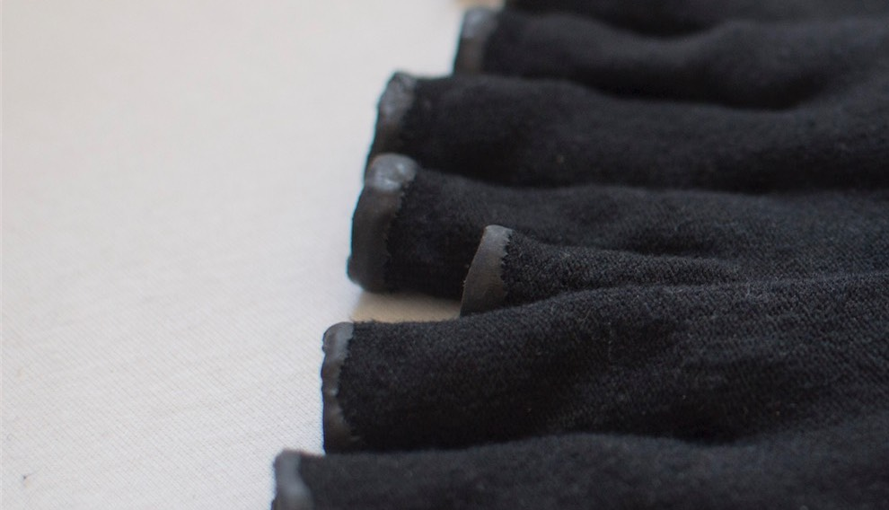
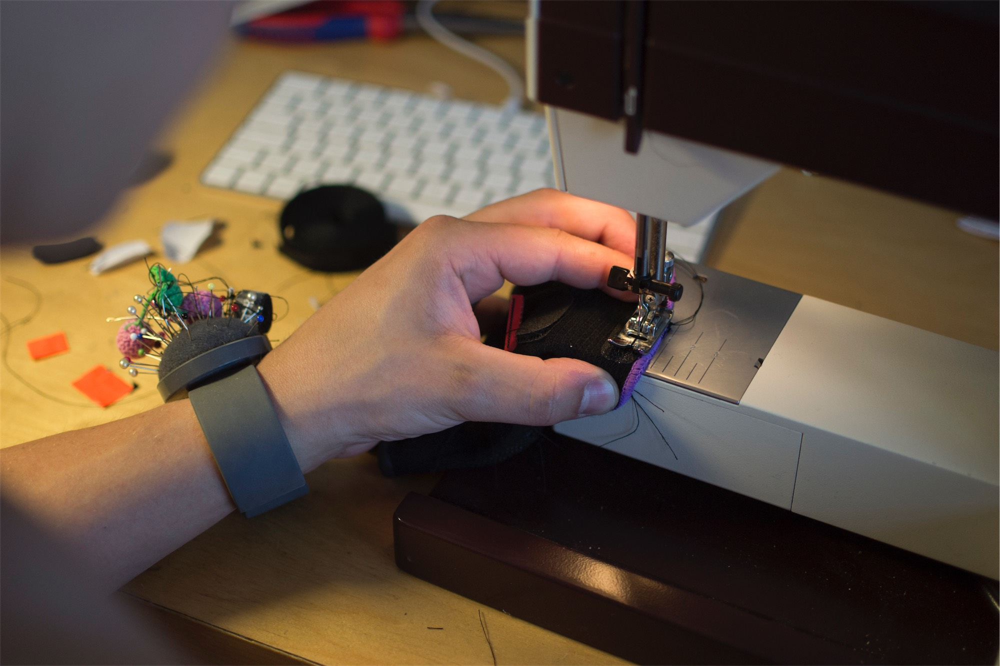
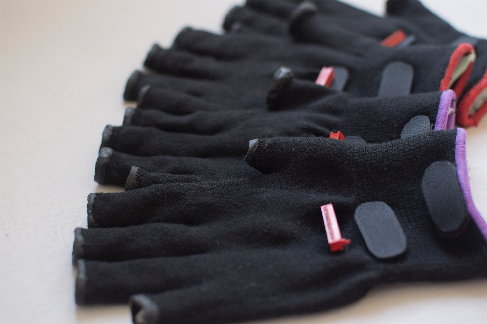

# Building the Glove

This is a building instruction for the glove needed to build the the [Unfolding Space Glove](https://github.com/jakobkilian/unfolding-space).

## Overview

The glove has two layers of fabric with the vibration motors and cables in between. There is velcro to attach the Unfolding Space Carrier Board (see pcb directory of this repo) to it and a ribbon cable exiting the back of the glove terminating with an idc connector to link glove and board. The end result looks like this (two sizes: red = big and purple = small): 

## 1. Textile Work

First of all, we need the inner and outer layers of the glove. You could sew these yourself, but this is very time-consuming. I therefore looked for suitable models which I could work with. It quickly became clear that both gloves had to be very thin, because otherwise the construction would be too thick and uncomfortable. In order to achieve a high degree of stretch and durability at the same time, I looked primarily for polyamide textiles. Most of them are work gloves with coating, which made the search more difficult.

I found what I was looking for in a very thin inner layer of a polyamide [clean room glove ](https://www.munitec-gmbh.de/polyamid-reinraum-handschuhe-glatt.html)(article number 12025) from Munitec (they were kind enough to provide me with samples of their collection). They can also be cut well without becoming frayed.

The outer layer should meet basic aesthetic requirements, look neutral and also be stretchable and resistant. Here it was a no name (Worksafe L71-720) product from Amazon (though I hate buying there).

### Outer Layer

I cut the fingers of the gloves halfway so that the two sizes would fit as well as possible on different hands. 

| Cut the Fingers Halfway                                                                                              |
|:--------------------------------------------------------------------------------------------------------------------:|
|  |
| To avoid fraying in the first place, it proved most effective to use a sharp kitchen knife                           |

Since I don't have a tool to hem the cut edges of the fingers (no idea how that would work), I experimented a bit with anti-fraying glue and the like and finally settled on liquid latex, typically used to make anti-slip socks. With some wooden stuffing of the fingers I was able to dip them into the latex and cut a clean edge after drying:

| Stuffing Material                                                                       | Just Before Dipping                                                                                                 |
|:---------------------------------------------------------------------------------------:|:-------------------------------------------------------------------------------------------------------------------:|
|  |  |

| After Dipping                                                                                           | Drying...                                                                          |
|:-------------------------------------------------------------------------------------------------------:|:----------------------------------------------------------------------------------:|
|  |  |

| Getting Rid of Overhang                                                       | Finish Edges                                                                                                                |
|:-----------------------------------------------------------------------------:|:---------------------------------------------------------------------------------------------------------------------------:|
|  |  |

Resulting in these edges that do their job of not fraying and not looking too bad:

| Result                                                                                                         |
|:--------------------------------------------------------------------------------------------------------------:|
|  |

## Inner Layer

Next I determined the position of the motors so that they are equally spread over the available surface and do not interfere with hand movements. 

| Positioning of the Motors                                                                                                                             | Reproducing Inner Layers                                                                                            |
|:-----------------------------------------------------------------------------------------------------------------------------------------------------:|:-------------------------------------------------------------------------------------------------------------------:|
|  |  |

The inner gloves were cut in the same way as the outer ones but with slightly longer fingers so that they could be folded over and sewn by hand to the outer glove (no picture).

## 2. Preparing the Motors and Cables

Regarding the motors experience from older prototypes revealed two particular weaknesses that can occur when there is a lot of physical stress: 

- The **breaking of the solder joints** on the vibration motor's solder pad.
- The **tearing of cables from the connector** on the other side due to excessive tensile stress. These occur due to the great mobility of the hands.

To prevent **breaking of the solder joints**, I soldered the cables onto the soldering pad so that they ran past the motor to the rear. If you then wrap the entire motor in a heat-shrink tube, the soldering point is relieved of strain in a cost-effective way and the problem is solved. 

| Soldering of the cables                                                                          |
|:------------------------------------------------------------------------------------------------:|
|  |

| Add Heat Shrink Tubing                                                                                                                        | Shrink Them                                                                               |
|:---------------------------------------------------------------------------------------------------------------------------------------------:|:-----------------------------------------------------------------------------------------:|
|  |  |

| Before and After                                                                                        |
|:-------------------------------------------------------------------------------------------------------:|
|  |

Next to prevent **tearing of cables from the connector** I tried to route the cables in a meandering way on the inner layer of the glove so that they bypass all the joints of the hand that can cause tension on the cable.

| Routing Experiments                                                                                                                  |
|:------------------------------------------------------------------------------------------------------------------------------------:|
|    |
| With this routing, the cable is not heavily stressed by any the movement of the hand. The dots represent the position of the motors. |

| Testing the Cable Exit Point                                                                                                                         |
|:----------------------------------------------------------------------------------------------------------------------------------------------------:|
|  |
| Testing the exit point of the flat ribbon cable that is used in the final setup.                                                                     |

## 3. Implementation of the Wiring

With the routing being determined, I could produce the wiring strands using flat ribbon cables:

| Cutting, Soldering, Wrapping                                                                                          | Apply Adhesives to Motors                                                                                |
|:---------------------------------------------------------------------------------------------------------------------:|:--------------------------------------------------------------------------------------------------------:|
|  |  |

| Crimping the IDC Connector & Testing Connections                                                |
|:-----------------------------------------------------------------------------------------------:|
|  |

| Resulting Wiring Glued onto the Glove                                                           |
|:-----------------------------------------------------------------------------------------------:|
|  |

## 4. Sewing of the Cables

The cables then had to be sewed onto the glove by hand. For this I used a cardboard hand from the craft shop that. 

| Sewing                                                                                                                                   |
|:----------------------------------------------------------------------------------------------------------------------------------------:|
|  |
| The quite time consuming process of sewing all cables onto the inner textile layer                                                       |

| Result                                                                                                                       |
|:----------------------------------------------------------------------------------------------------------------------------:|
|  |
|                                               |

Now the already joined outer part of the glove could be put over the inner part and the glove was practically completed.

| Steps of Implementation                                                                                                                                                                                                                                                                                                                                                    |
|:--------------------------------------------------------------------------------------------------------------------------------------------------------------------------------------------------------------------------------------------------------------------------------------------------------------------------------------------------------------------------:|
|  |
| 1) The three components separated. 2) Sewing of components completed. 3) Glove completed                                                                                                                                                                                                                                                                                   |

## 5. Adding Velcros and Finishing

Finally, I added some Velcro: firstly, to attach the "Unfolding Space Carrier Board" to the glove; secondly, to connect the inner and outer layers at the wrist without sewing them together, so that you can open them in case of error.

| Sewing the Velcros                                                                        |
|:-----------------------------------------------------------------------------------------:|
|  |
| The sewing of the velcros was done with a sewing machine.                                 |

| Velcros for the Carrier Board                                                                                                                                                 |
|:-----------------------------------------------------------------------------------------------------------------------------------------------------------------------------:|
|  |
| The velcros for fastening the carrier board and the slot where the ribbon cable exits the glove.                                                                              |

## Result

 

 

**If you have any questions, feel free to mail me!**
