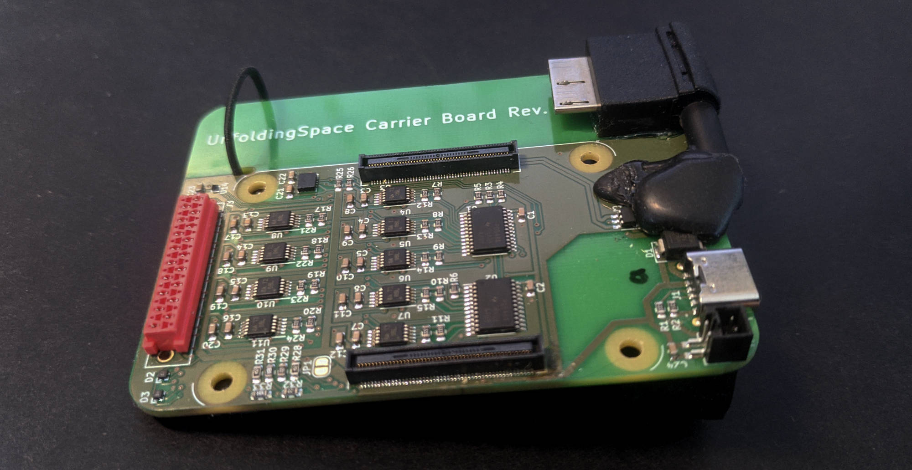
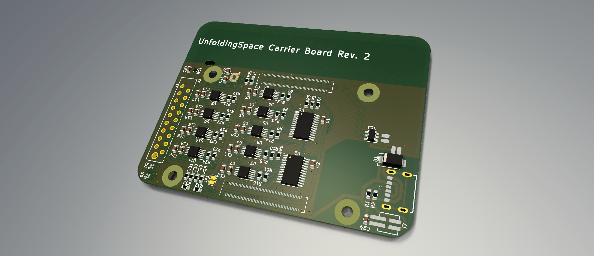

# Custom PCB: Unfolding Space Carrier Board Rev. 2

## PCB Design Files

You can find the **design files** in [KiCad-Project-Rev2](/pcb/KiCad-Project-Rev2) and exports (**schematic, pcb layout, rendering**) in [exports](pcb/exports).

**Design rules** are based on the specifications of a *2-layer, complex, ENIG* board at aisler.net. Note that some of my rules thus are a bit unusual (e.g. clearance ≥ 0.1 mm or track width ≥ 0.2 mm; through whole ≥ 0.3mm). [See all specifications of Aisler here.](https://aisler.net/help/design-rules-and-specifications/design-rules) 

There also is a [Aisler project of the Rev. 2 board online](https://aisler.net/p/WSTOTZAR) if you are from Europe. Attention: the BOM / parts list needs to be updated to respective components by hand!

## BOM / parts list

See [bom-pcb](/pcb/bom-pcb.csv) for a list with all needed parts for the pcb alone.

## Known issues

- Some parts (e.g. RGB LEDs, IMU and MMC) are very (very) small! We could successfully reflow them but it was quite a hustle.
- The RGB LEDs in the upper right corner are very bright in the current layout. We thus use GPIO pins of the raspi with pull-up resistor to drive them on lower light intensity. Consider changing the resistors on the board!
- The i2c multiplexer (PCA) is needed because the drv chips just have one i2c address. You could also use the drv2603 and use pwm to drive them. Writing on all 9 drvs with the multiplexer takes around 3ms. Not much time to save anyway...
- Shortly before dispatch, the pico-spox plug in the bottom left corner was added to drive a cooling fan with 5 V. Consider using a 4-pin plug and using pwm instead.

## Credits

Thanks to **[mattikra](https://github.com/mattikra)** and **[a2800276](https://github.com/a2800276)** from Press Every Key for helping me with the PCB design and ordering of the boards and parts!

Note the txt files in the directories of 3rd party assets for credits and licenses. 
